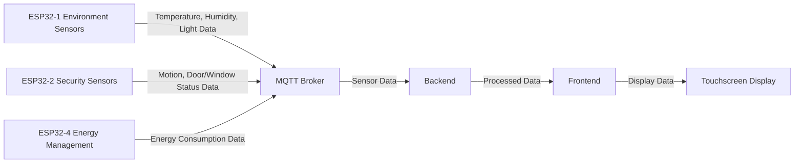
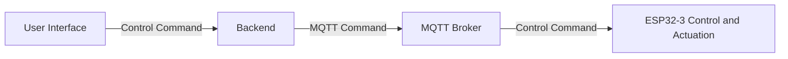

# Flow Diagrams

## Sensor Data Flow Diagram

```mermaid
flowchart LR
    ESP1[ESP32-1 Environment Sensors] -->|Temperature, Humidity, Light Data| MQTT[MQTT Broker]
    ESP2[ESP32-2 Security Sensors] -->|Motion, Door/Window Status Data| MQTT
    ESP4[ESP32-4 Energy Management] -->|Energy Consumption Data| MQTT
    MQTT -->|Sensor Data| Backend[Backend]
    Backend -->|Processed Data| Frontend[Frontend]
    Frontend -->|Display Data| Display[Touchscreen Display]
```

## Control Command Flow Diagram

```mermaid
flowchart LR
    UI[User Interface] -->|Control Command| Backend[Backend]
    Backend -->|MQTT Command| MQTT[MQTT Broker]
    MQTT -->|Control Command| ESP3[ESP32-3 Control and Actuation]
```
