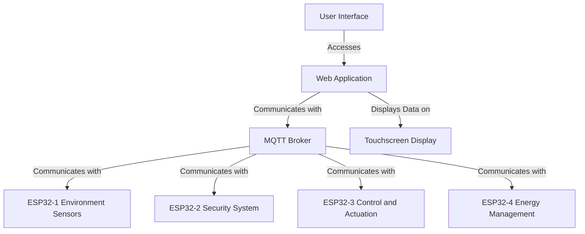

# High-Level System Architecture Diagram

```mermaid
graph TD
    UI[User Interface] -->|Accesses| WebApp[Web Application]
    WebApp -->|Communicates with| MQTT[MQTT Broker]
    WebApp -->|Displays Data on| Display[Touchscreen Display]
    MQTT -->|Communicates with| ESP1[ESP32-1 Environment Sensors]
    MQTT -->|Communicates with| ESP2[ESP32-2 Security System]
    MQTT -->|Communicates with| ESP3[ESP32-3 Control and Actuation]
    MQTT -->|Communicates with| ESP4[ESP32-4 Energy Management]
```
