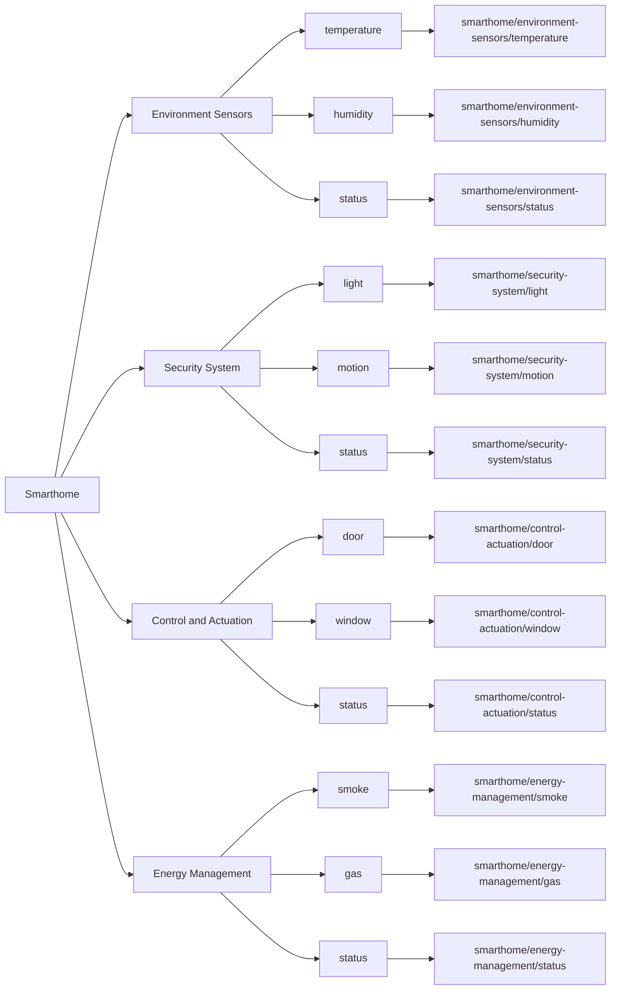

# MQTT Topics Documentation for Smart Home Project

## Overview

This document outlines the MQTT topics used in the Smart Home project. MQTT (Message Queuing Telemetry Transport) is a lightweight messaging protocol that allows IoT devices to communicate with each other. In this project, MQTT is used to facilitate communication between the Raspberry Pi Zero, ESP32 devices, and the web application.

## MQTT Topics Structure

Below is the structure of the MQTT topics used in this project, visualized as a hierarchical diagram.

